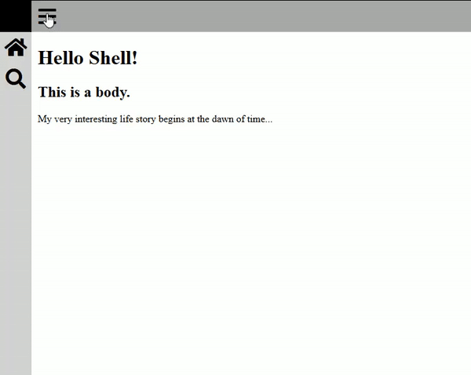

# Welcome to Shell CSS
## A crispy shell for your beautiful website.



### How to use:
1. Clone this repo
2. Open index.html
3. Take a look at the example page. That's about all it can do so far.

### What is shell CSS?
Shell CSS is a crispy shell for your website. It wraps the body content inside a collapsable side bar and a permanent top navbar. Everything else is up to you. Just put what you'd normally put in the body inside the "body-content-container" and you're off to the races.

### How do I include this in my website?
I recommend you copy the index page from this repo and go from there. Otherwise feel free to use the shell.css and shell.js independently in your project. Just remember the shell hierarchy:

```
master container
|
|---side-nav-container
|   |
|   ---- nav-item
|
----body-container
    |
    |---body-nav-container
    |   |
    |   ---- nav-item
    |
    ----body-content-container
        |
        ---- <div>Body stuff here</div>
```